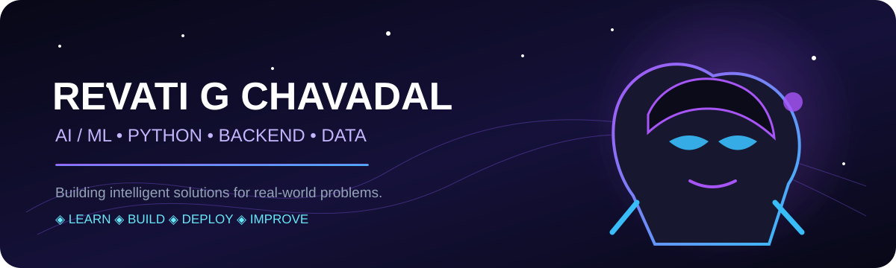

# ✦ Revati G Chavadal ✦

### AI / ML Student · Python Developer · Backend Builder

**Building intelligent solutions for real-world problems.**

`AI/ML` · `Python` · `FastAPI` · `Data` · `Backend` · `Cloud`

---

## 🌸 01 — A Little About Me

> **Hello! I'm Revati.** 👋  
> An AI/ML student from India who enjoys turning ideas into practical technology.

- 🤖 Exploring **Artificial Intelligence & Machine Learning**
- 🐍 Building with **Python**
- ⚡ Working with **FastAPI, REST APIs and modern backend tools**
- 📊 Interested in **Data Analytics, backend engineering and cloud**
- 🚀 Learning, experimenting and shipping projects

`AI/ML`　`Python`　`Backend`　`Data`　`Cloud`　`Open Source`

---

## ⚔️ 02 — My Tech Arsenal

**AI / ML** · Machine Learning · Scikit-learn · Pandas · NumPy  
**Backend** · FastAPI · REST APIs · Node.js · Express  
**Data** · SQL · MySQL · MongoDB · Data Analytics  
**Tools** · Git · GitHub · Docker · AWS

---

## 🧠 03 — GitHub Intelligence

&nbsp;&nbsp;

  

---

## 🎬 05 — Profile Assembly

**IDENTITY → SKILLS → GITHUB → ACTIVITY → PROFILE ASSEMBLED**

---

## 🌱 06 — Currently Learning

| 🧠 AI / ML | ⚡ Engineering | ☁️ Modern Stack |
|:---:|:---:|:---:|
| Advanced ML | FastAPI | Docker |
| Model Building | REST APIs | Cloud |
| Data Analytics | React | AWS |

---

## 🌌 07 — Developer Philosophy

### **Think deeply. Build boldly. Learn continuously.**

*I don't just want to use technology — I want to understand it, build with it, and make it useful.*

`BUILD` ✦ `LEARN` ✦ `DEPLOY` ✦ `IMPROVE`

---

## 📫 08 — Let's Connect

  

### ✨ Thanks for visiting ✨

**Keep building. Keep learning. Keep creating. 🚀**

---

